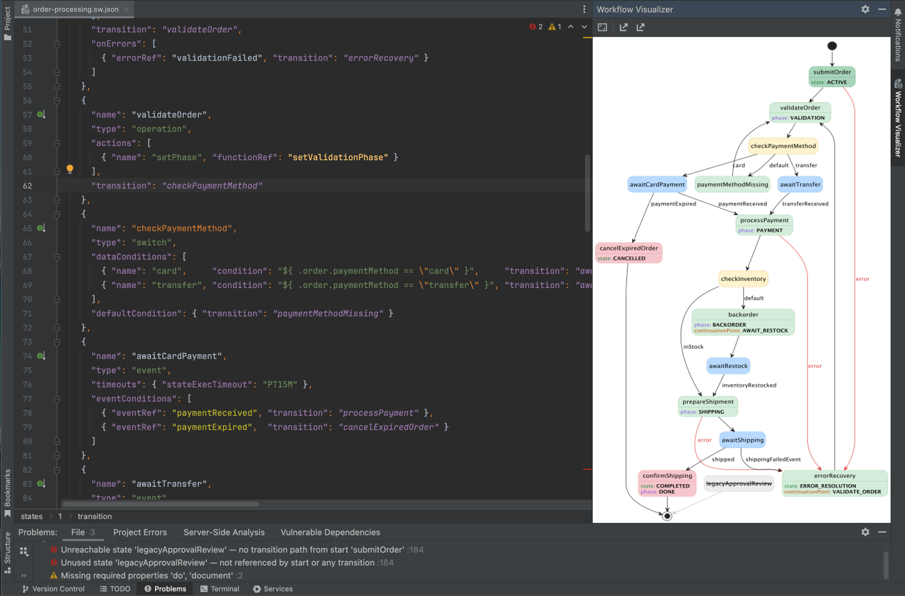
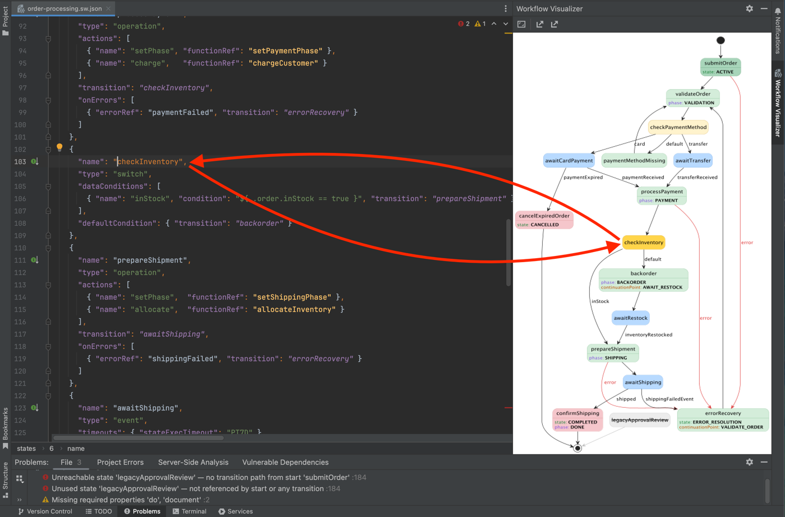
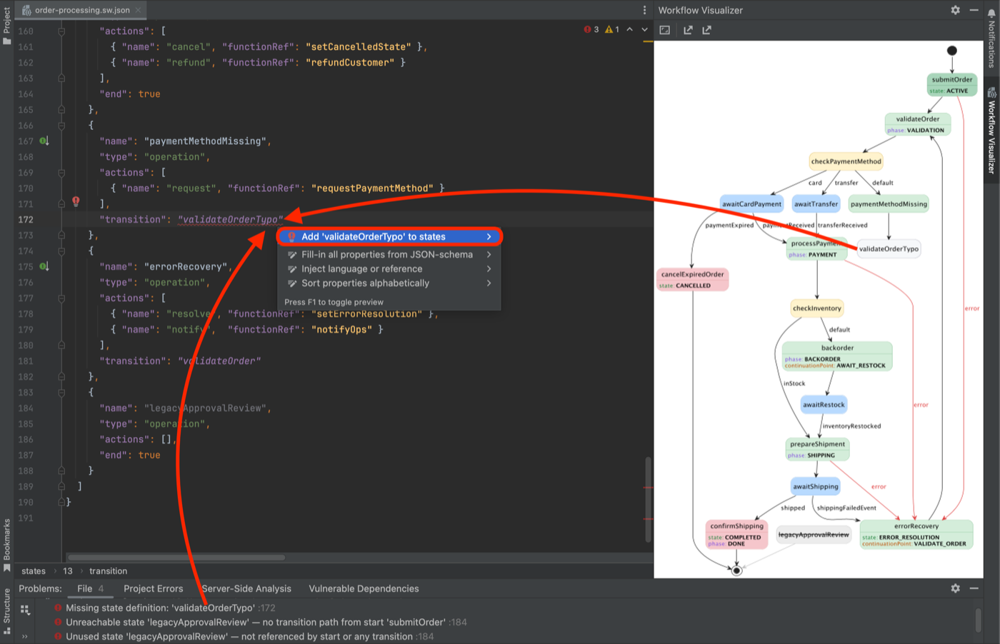
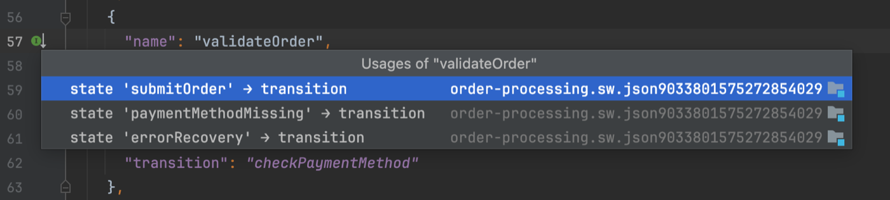
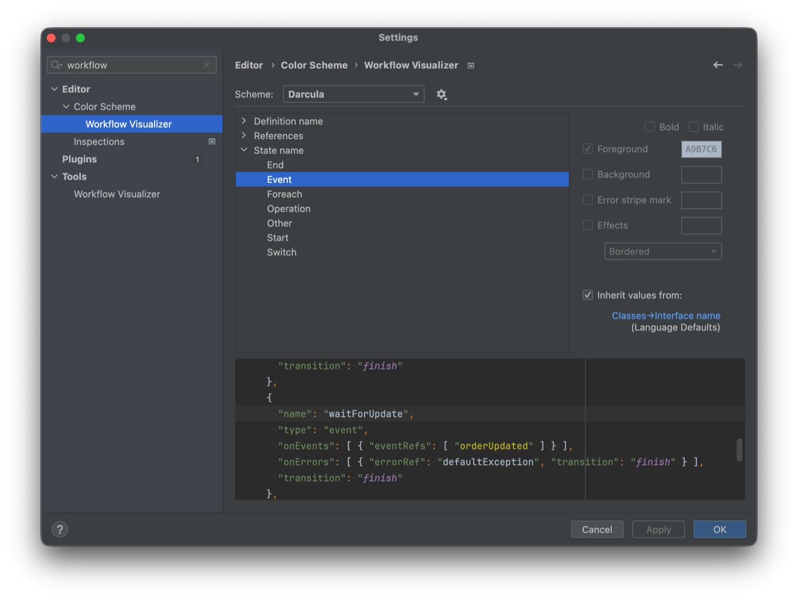
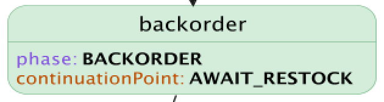
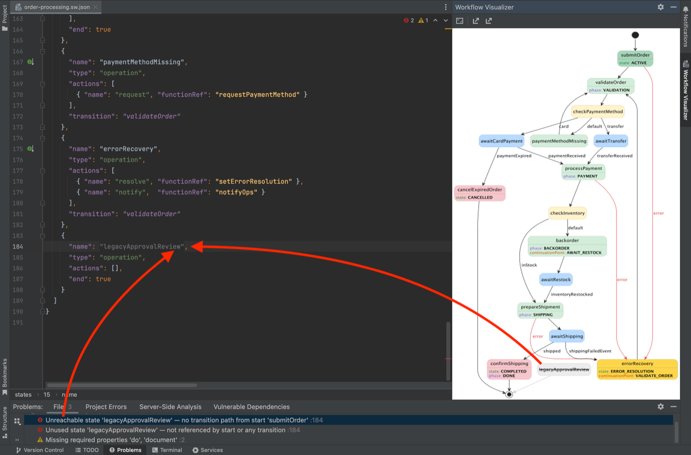
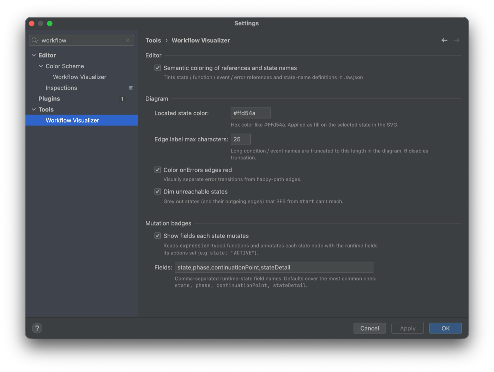

# Workflow Visualizer

IDE-native preview and analysis for [Serverless Workflow](https://serverlessworkflow.io/)
`.sw.json` files in IntelliJ-based IDEs.

The plugin renders the workflow as a PlantUML state diagram in a side tool window
and adds first-class language support to the JSON editor: navigation, inspections,
quick-fixes, hover previews, and semantic colors. No browser, no Graphviz, no server.



---

## Installation

The plugin is distributed through a custom IntelliJ plugin repository. Once
added, the IDE installs and auto-updates the plugin like any marketplace plugin.

1. **Settings → Plugins → ⚙ (gear icon) → Manage Plugin Repositories…**
2. Add this URL:
   ```
   https://raw.githubusercontent.com/zacikpetr/workflow-visualizer/main/updatePlugins.xml
   ```
3. Open the **Marketplace** tab and search for **Workflow Visualizer**, then
   install. (Or **Installed** → updates surface automatically on the next IDE
   check.)
4. Restart the IDE when prompted.

Compatible with IntelliJ IDEA Community / Ultimate **2025.2 and later**
(no upper version bound).

---

## Features

### Live diagram, bidirectional navigation

Open any `.sw.json` file. The **Workflow Visualizer** tool window (right side)
shows the rendered diagram and updates on every edit. Click a state in the
diagram → the editor caret jumps to its definition. Move the caret in the
JSON → the matching state highlights in the diagram.

**Navigating the diagram:** scroll to pan, ⌘/Ctrl+scroll or a trackpad pinch
(macOS) to zoom, drag to move. The toolbar's **Zoom In** / **Zoom Out** and
**Fit to Window** buttons do the same. A one-time hint points these out the first
time a diagram opens. The buttons and gestures work on any keyboard layout; the
`Ctrl+=` / `Ctrl+-` (and `Ctrl+NumpadPlus` / `Ctrl+NumpadMinus`) zoom shortcuts
assume a US-style layout, so on other layouts prefer the buttons or gestures.



### Inspections + quick-fixes

The plugin ships eight inspections grouped under **Settings → Editor →
Inspections → Serverless Workflow**:

| Inspection | Default severity | What it catches |
|---|---|---|
| Missing definition | Error | `transition` / `functionRef` / `eventRef` / `errorRef` resolves to no `states[] / functions[] / events[] / errors[]` entry |
| Duplicate names | Error | Two entries in the same top-level array share a `name` |
| Missing `start` | Error | Workflow has no `start` field |
| No terminal state | Error | No state with `end: true` and every state has outgoing transitions |
| Unreachable state | Error | State can't be reached by BFS from `start` (transitions + onErrors + dataConditions + eventConditions + defaultCondition) |
| Unused state | Error | State is never referenced as `start` or any transition target |
| Switch without `defaultCondition` | Warning | Switch with `dataConditions` and no `defaultCondition` → potential deadlock |
| Event state without `timeouts` | Warning | Event-waiting state may wait indefinitely |

Each unresolved reference comes with a quick-fix that inserts a stub
definition into the right top-level array (Alt+Enter → **Add 'X' to errors**
etc.).



### Navigation, usages, hover preview

The plugin contributes PSI references for every state/function/event/error
reference. **Ctrl/Cmd-B** (Go to Declaration), **Find Usages**, and **Rename
Refactoring** all work out of the box.

Each definition's `name` shows a **gutter icon** with the usage count. Click
opens a popup with one entry per usage, rendered as the JSON path inside the
enclosing state plus a snippet of the discriminator (the condition expression
or eventRef of the surrounding branch). Usages inside unreachable states are
struck through and dimmed.

**Cmd-hover** (or **F1** / Ctrl+Q for Quick Documentation) over a reference
shows an inline preview of the target definition's body — no jump to source
needed.



### Semantic coloring

References and state-name definitions are tinted per kind/type. Defaults
inherit from each color scheme; rebind individual keys under **Settings →
Editor → Color Scheme → Workflow Visualizer**.



### Mutation badges (opt-in)

Many workflows track runtime state in jq-mutated fields (typically `state`,
`phase`, `continuationPoint`, `stateDetail`). Enable
**Settings → Tools → Workflow Visualizer → Show fields each state mutates** and
the diagram annotates each state with the literal values its actions set.

Field list is configurable in the same panel — projects with custom field
names just edit the comma-separated string.



### Dead code visualization

When the **Dim unreachable states** toggle is on (default), states the BFS
from `start` can't reach (and their outgoing edges) render in grey with a
struck-through label — the diagram-side mirror of the editor's unreachable
inspection highlight.



### Toolbar

Actions in the tool window toolbar:

- **Zoom In** / **Zoom Out** — `Ctrl+=` / `Ctrl+-` (also ⌘/Ctrl+scroll or pinch)
- **Fit to Window** — reset zoom/pan to auto-fit
- **Export as SVG…** — save the rendered SVG
- **Export as PUML…** — save the underlying PlantUML source

---

## Configuration

All settings live under **Settings → Tools → Workflow Visualizer**.



| Setting | Default | Description |
|---|---|---|
| Semantic coloring | On | Tint references and state-name definitions in the JSON editor |
| Located state color | `#ffd54a` | Fill color applied to the state matching the editor caret |
| Edge label max characters | `25` | Truncate condition / event labels on diagram edges; `0` disables |
| Color `onErrors` edges red | On | Tint failure-path edges to separate them from happy-path |
| Dim unreachable states | On | Grey out states (and their outgoing edges) unreachable from `start` |
| Show fields each state mutates | Off | Render per-state mutation badges (see above) |
| Fields | `state,phase,continuationPoint,stateDetail` | Comma-separated runtime-state field names to surface as badges |

Changes apply on **Apply** without an IDE restart.

---

## Specification support

Built for **Serverless Workflow v0.8** (`specVersion: "0.8"`). The plugin
explicitly **disables JetBrains' JSON Schema validation for `.sw.json`**, which
would otherwise match the v1.0 schema from schemastore.org and produce false
"Missing required properties" errors against v0.8 documents.

The inspections and references are structural and not strictly version-tied —
v0.9 / v1.0 workflows render but the schema-driven completion / validation that
the platform would otherwise provide is intentionally suppressed.

---

## Building from source

```bash
git clone https://github.com/zacikpetr/workflow-visualizer.git
cd workflow-visualizer
./gradlew buildPlugin
# Result: build/distributions/workflow-visualizer-<version>.zip
```

Open the project in IntelliJ IDEA as a Gradle project to develop; `./gradlew runIde`
launches a sandbox IDE with the plugin loaded.

See [RELEASING.md](RELEASING.md) for the release process.

---

## Changelog

See [CHANGELOG.md](CHANGELOG.md).

---

## License

GPLv3 — inherited from the bundled [PlantUML](https://plantuml.com/) engine.
See [LICENSE](LICENSE) for the full text and [NOTICE](NOTICE) for the project
copyright statement and a list of bundled third-party libraries.

## Author

**Petr Žáčík** — <zacik.petr@gmail.com>

Issues and contributions welcome via [GitHub Issues](https://github.com/zacikpetr/workflow-visualizer/issues).
